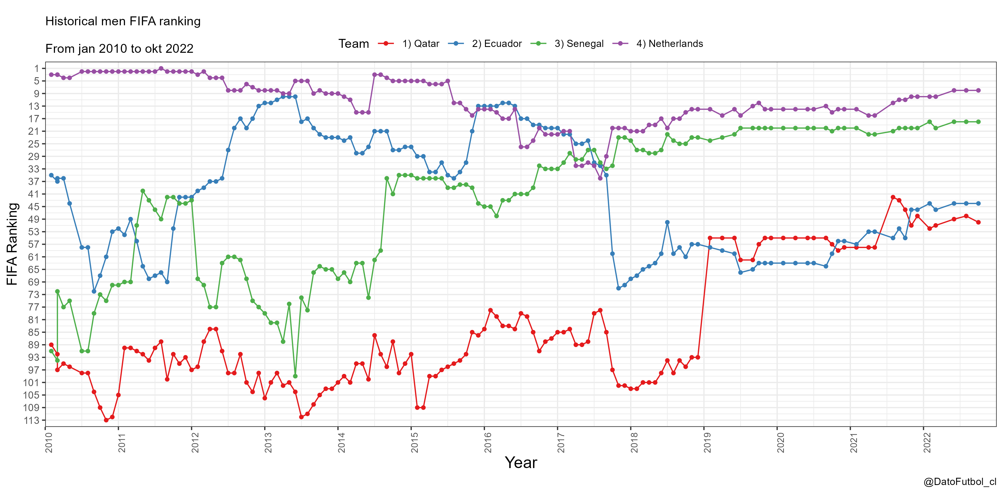

# Historical men's FIFA ranking R Shiny app

This repository contains the codes of a R Shiny app where you can visualize the men's FIFA ranking timeline of different nations.

[Link to R Shiny app](https://pjastam.shinyapps.io/fifa-ranking/) (last update: October 2022). This is a new version, with updated data and some extended features. Here is the [link to the original R Shiny app](https://bustami.shinyapps.io/ranking_fifa/) (last update: April 2020).

* The data (from August 1993 to October 2022) is based on the official [FIFA website](http://www.fifa.com/fifa-world-ranking/ranking-table/men/) and was downloaded from [Kaggle](https://www.kaggle.com/datasets/cashncarry/fifaworldranking). Data is in the "FIFA_ranking.rds" file.

* The app has a date range selector and 4 nation selectors. It is possible to visualize from 1 to 4 nations at the same time. The default is the selection of countries in group A of the 2022 world cup.

* Downloading graphs option as PNG file. 

Output example:

